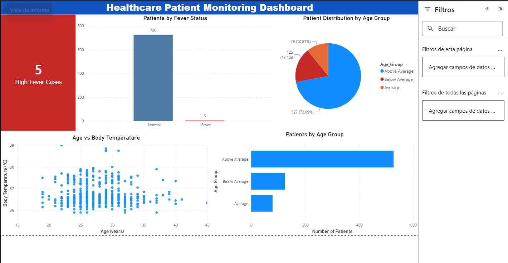
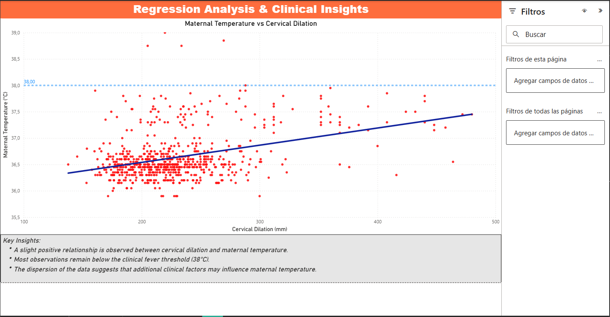

## 🏥 Healthcare Patient Monitoring System

<p align="center">


</p>

---

## 📌 Project Overview

Healthcare Patient Monitoring System is an end-to-end Data Analytics project that simulates the monitoring of clinical patient data.

The project processes patient information, detects fever cases using predefined clinical thresholds, performs linear regression analysis, exports technical reports, and visualizes the results through an interactive Power BI dashboard.

The objective is to demonstrate a complete Data Analytics workflow, from data cleaning and feature engineering to business-oriented reporting and visualization.

---

## 💼 Business Problem

Healthcare professionals continuously monitor patient data to identify abnormal clinical conditions and support medical decision-making.

Analyzing large volumes of patient information manually can be time-consuming and may delay the identification of relevant patterns.

This project simulates that scenario by automatically detecting fever cases, analyzing temperature trends, and generating reports that summarize the most important clinical indicators.

---

## 🛠 Technology Stack

| Category | Technologies |
|-----------|--------------|
| Programming Language | Python 3.14 |
| Data Processing | Pandas, NumPy |
| Statistical Analysis | Linear Regression |
| Visualization | Microsoft Power BI |
| Reports | Excel, TXT, PDF |
| Version Control | Git & GitHub |

---

## 📊 Dataset

The project analyzes a healthcare dataset containing **731 patient records**.

#### Features

| Feature | Description |
|----------|-------------|
| Age | Patient age |
| Temperature_Pre | Body temperature before the procedure |
| Temperature_Post | Body temperature after the procedure |
| Cervical_Dilation | Cervical dilation measurement |
| Average_Temperature | Average body temperature |
| Age_Group | Engineered age category |
| Fever_Alert | Target variable (0 = Normal, 1 = Fever) |

The project automatically generates engineered features including Average Temperature, Age Group and Fever Alert.

---

## 🔬 Data Analysis Pipeline

The project follows a complete Data Analytics workflow.

#### 1. Data Loading

The healthcare dataset is imported from Excel using Pandas.

#### 2. Data Cleaning

Clinical variables are validated and cleaned before analysis.

#### 3. Feature Engineering

Average temperature, age groups, and fever alerts are automatically generated.

#### 4. Statistical Analysis

Summary statistics and linear regression are calculated to evaluate temperature trends.

#### 5. Fever Detection

Patients are classified according to the predefined fever threshold.

#### 6. Report Generation

Results are automatically exported to Excel and TXT reports.

#### 7. Dashboard Visualization

Power BI is used to present the analysis through interactive charts and KPIs.

---

## 📈 Power BI Dashboard

| Dashboard Overview | Regression Analysis |
|--------------------|---------------------|
|  |  |

The dashboard summarizes the healthcare monitoring analysis through business-oriented visualizations.

It includes:

- High Fever Cases KPI
- Patients by Fever Status
- Patient Distribution by Age Group
- Age vs Body Temperature visualization
- Maternal Temperature vs Cervical Dilation regression analysis
- Clinical insights

Project files:

- `healthcare_patient_monitoring_dashboard.pbix`
- `healthcare_patient_monitoring_report.pdf`

---

## 📄 Generated Reports

After running the pipeline, the following reports are automatically generated:

| File | Description |
|------|-------------|
| patient_monitoring_results.xlsx | Processed patient dataset including engineered features |
| healthcare_analysis_report.txt | Statistical summary and regression analysis |
| healthcare_patient_monitoring_report.pdf | Dashboard exported from Power BI |

---

## 📁 Project Structure

```text
healthcare-patient-monitoring-system/
│
├── data/
│   └── patient_monitoring_dataset.xlsx
│
├── reports/
│   ├── healthcare_patient_monitoring_dashboard.pbix
│   └── healthcare_patient_monitoring_report.pdf
│
├── results/
│   ├── patient_monitoring_results.xlsx
│   └── healthcare_analysis_report.txt
│
├── src/
│   └── healthcare_patient_monitoring.py
│
├── images/
│   ├── healthcare_patient_monitoring_report1.png
│   └── healthcare_patient_monitoring_report2.png
│
├── README.md
├── requirements.txt
├── LICENSE
└── .gitignore
```

---

## 🚀 Installation

Clone the repository:

```bash
git clone https://github.com/mauriciocasanovas/healthcare-patient-monitoring-system.git
```

Navigate to the project folder:

```bash
cd healthcare-patient-monitoring-system
```

Install the required dependencies:

```bash
pip install -r requirements.txt
```

---

## ▶️ Usage

Run the healthcare monitoring pipeline:

```bash
python src/healthcare_patient_monitoring.py
```

The execution will automatically:

- Load the healthcare dataset
- Clean and validate patient information
- Generate engineered features
- Detect fever cases
- Perform linear regression analysis
- Export an Excel report
- Export a technical TXT report
- Create data ready for the Power BI dashboard

Open the Power BI dashboard to explore the results visually.

---

## 📈 Results

The project demonstrates how Data Analytics can support healthcare monitoring by automatically processing clinical information and identifying patients with fever.

The generated dashboard provides a business-friendly overview of:

- High fever cases
- Patient age distribution
- Body temperature behavior
- Maternal temperature trends
- Regression analysis
- Clinical indicators

#### Project Summary

| Metric | Value |
|---------|------:|
| Patients Analyzed | 731 |
| Invalid Records Removed | 0 |
| Average Age | 27.7 years |
| Average Temperature | 36.64 °C |
| Fever Cases | 5 |
| Fever Rate | 0.7% |
| Correlation Coefficient | 0.4156 |

The linear regression analysis identified a **moderate positive relationship** between cervical dilation and maternal temperature, while the percentage of fever cases remained within the expected clinical range.

The Power BI dashboard allows healthcare information to be explored interactively through KPIs, demographic distributions, scatter plots, and regression analysis.

---

## 👨‍💻 Author

**Mauricio Javier Casanovas Juárez**

GitHub: https://github.com/mauriciocasanovas

---